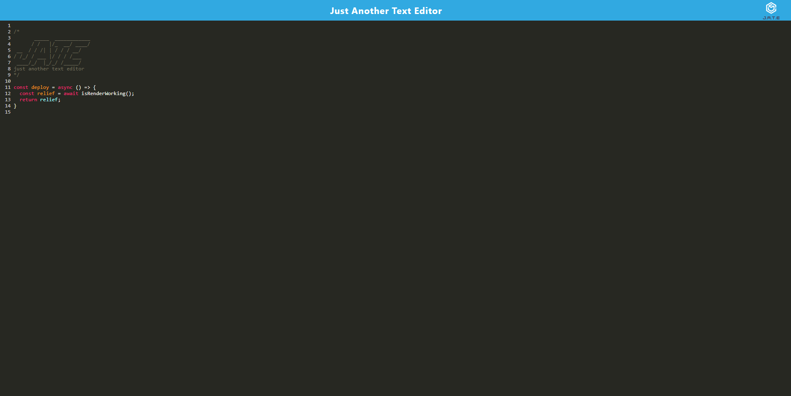

# README

## Description

A PWA text editor that can be installed and works offline.  Saves your work whenever you click away from the window

## Table of Contents

- [Visuals](#Visuals)

- [Installation](#Installation)

- [Usage](#Usage)

- [Contribute](#Contributing)

- [Tests](#Tests)

- [Questions](#Questions)

## Visuals

## Installation

None needed.  

## Usage

Navigate to the page and type into the editor.  Click away to save progress.  Retains progress on reload.  If internet connection is lost, the webpage will still load as long as you have visited the page before.  Can optionally be installed and added as an icon to the start menu or desktop.

## Links

[Page Link](https://just-another-text-editor-tyx6.onrender.com)

[Github Repo](https://github.com/jtschams/offline-text-editor/tree/main)

[Github Author](https://github.com/jtschams)

## Contributing

Feel free to fork the repo if you would like to make any improvements.

## Tests

No testing available.

## Questions

My Github account can be found at [jtschams](https://github.com/jtschams).

For any other questions, please contact me at jtschams@yahoo.com.

## License
    

The license used is MIT, which can be viewed in the repository.
